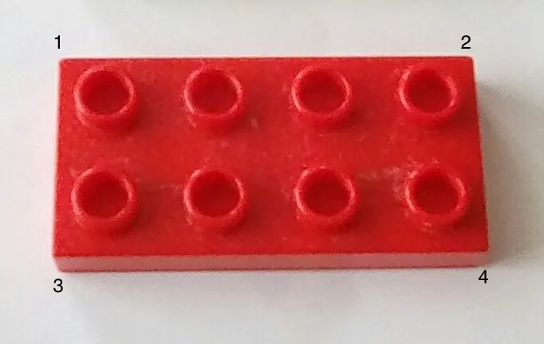
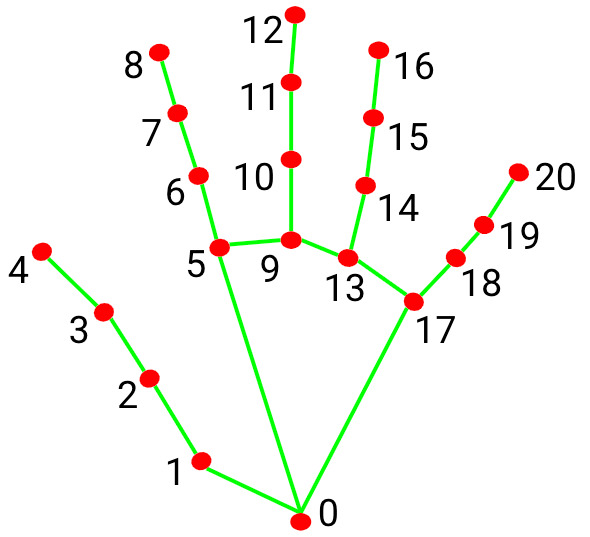

# Duplo Tower Study

## Environment Setup

*Disclaimer: This guide assumes Miniconda is available, which it should be since both the DevEv and Flex projects require it.*

- First create and activate a conda environment:

```
conda create --name duplo python=3.8

conda activate duplo
```

- Next install all the dependencies:
```
pip install opencv-python==4.7.0.72 numpy pandas mediapipe pycocotools

conda install pytorch==1.12.1 torchvision==0.13.1 torchaudio==0.12.1 cudatoolkit=11.3 -c pytorch
```

## Processing Pipeline
*Note: Whenever the name of a video file or a CSV file is passed to a Python script, the file extension such as* `.mp4` *and* `.csv`  *must be ommitted.*

### Extract Images
The first step in the pipeline is to convert the video into a folder of images and this done using the `extract_imgs.py` script:

```
python3 extract_imgs.py <video_file_name>
```

When this script is done running, you will have a folder with the same name as the video file containing individual frames of the video as `.jpg` files. These images will be used for all further processing.

### Tracking Duplo
Before we can compute the 3D pose of the duplos, we need to localize them within the frame. This is done by running the `object_tracking.py` script:

```
python3 object_tracking.py <images_folder>
```
- When this script is run, a window showing the first frame will pop up and the region where the duplo is present needs to be selected.
- This is done by clicking and dragging the mouse cursor over where the duplo is.
- Once the appropriate area is selected, press `Enter`. You will then be able to see the duplo being tracked across the rest of the frames.
- If you notice any errors in tracking or if the bouding box drifts too much, you can pause the processing by pressing the `p` key. Then you can reselect the duplo and press `Enter`.
- In the end you will have a CSV file with the same name as the image folder containing the bouding box information for all the frames.

### Duplo Pose Estimation
The 3D duplo poses are estimated using the `object_pose.py` script. Before running the script the model weights need to be downloaded from [here](https://oregonstateuniversity-my.sharepoint.com/:f:/r/personal/krishnaj_oregonstate_edu/Documents/duplo_weights?csf=1&web=1&e=bd7j74).

```
python3 object_pose.py <object_tracking_csv_file> <image_folder> <color>
```

- This script does not compute the pose directly. Instead it computes duplo keypoints which are later used to compute the 3D pose.
- When the script is done running you will have a CSV file (name ending in "_keypoints") with the detected keypoints in each frame.

### Hand Pose Estimation
The hand poses are estimated using the `hands.py` script.

```
python3 object_pose.py <object_tracking_csv_file> <image_folder> <video_file>
```

- When the script is done running you will have a CSV file (name ending in "_hands") with the (x,y,z) locations of 21 keypoints. The left hands keypoints are listed first.

## Correcting Detection
### Duplo Pose Corrections
To correct the duplo poses run the `corrector.py` script:
```
python3 corrector.py <keypoints_csv_file> <image_folder>
```
- This will pop up a window with the visualization of the detected duplo in the first frame.
- If the duplo pose is correct but mirrored, press the `f` key to flip it.
- If the duplo pose is incorrect, press the `a` key to annotate new keypoints. This will pop up a window where the keypoints can be annotated by clicking on the duplo corners with the mouse pointer.
- The annotation must be done as follows:


- Once the annotations are done press `Enter`
- If you're happy with the pose press `Right Arrow` to advance to the next frame. This will also save the results.
- When all the corrections are done, you will have two CSV files - one with the corrected keypoints and one with the corrected poses represented as `[centroid, roll, pitch, yaw]`.

### Hand Pose Corrections
To correct the duplo poses run the `corrector_hands.py` script:
```
python3 corrector_hands.py <hand_detection_csv_file> <image_folder>
```
- This will pop up a window with the visualization of the detected hands in the first frame.
- If the hands pose are correct but left and right hands are labeled in reverse, press the `f` key to flip it.
- If the hand pose is incorrect, press the `l` or `r` key to annotate new keypoints for the left or right hands respectively. This will pop up a window where the keypoints can be annotated by clicking on the hands with the mouse pointer.
- The annotation must be done as follows:


- Once the annotations are done press `Enter`
- If you're happy with the pose press `Right Arrow` to advance to the next frame. This will also save the results.
- When all the corrections are done, you will have a CSV file with the corrected hand poses.
